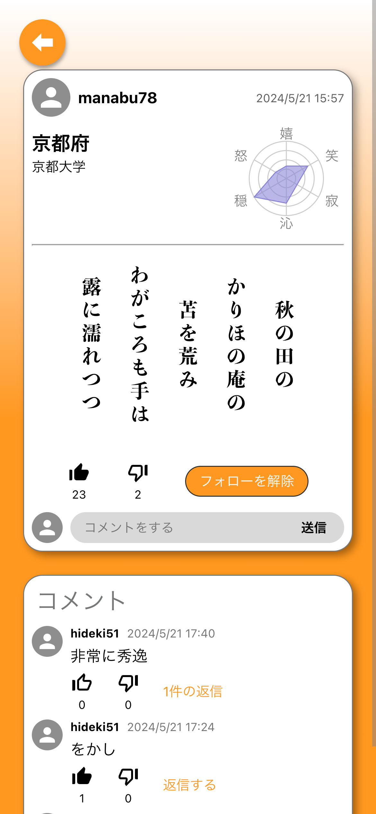

# 自己 PR 資料

## 自己紹介

- 氏名: 山下 暁天（やました あきたか）
- 生年月日: 2001 年 9 月 1 日
- 趣味: テニス，競技プログラミング
  - AtCoder: https://atcoder.jp/users/y_aut

### 学歴

- 京都大学工学部情報学科 計算機科学コース (2020-2024)
- 京都大学大学院情報学研究科 社会情報学コース (2024-)

### 資格

- TOEIC L&R 955 点 (2023/02)

## 技術スタック

### 言語・フレームワーク

ある程度使ったことのある言語やフレームワークの一覧を以下に示します．

- **C++**: 高速に動作することを活かして，競プロや思考エンジンなどの作成に使用．開発バイトで Windows ドライバやブートローダなど低レイヤーの部分を書くときにも用いる．
- **Python**: アプリ開発や研究など，幅広い用途で使用．
  - **Django**: バックエンド開発で DRF などを使用．
  - **PyTorch**: 研究などで，機械学習モデルの学習に使用．主に NLP で，Hugging Face なども併せて使用することも多い．
- **C#**: C++, Python と並んで使用頻度の高い言語．ほぼ不自由なく書ける．
  - **.NET Framework**: WinForms を作るときに使う．
  - **ASP.NET**: Web アプリを C# で作るならこれ．
  - **Unity**: スマホゲームを作ろうとしていた時期に勉強．Blender 等も併せて学習．
- **JavaScript**: Web アプリ開発で使用．
  - **React**: フロントエンド開発で使用．
  - **Vue.js**: アルバイトで使用．
  - **jQuery**: アルバイトや個人開発で使用．やや古いと言われるが，手軽に使えて良い．
- **Java**: 大学の授業で使用．C# と構文が似ているため，割と簡単に習得できた．
- **PowerShell**: アルバイトで使用．Azure VM の起動などの自動化スクリプトを書いた．
- **ShellScript (Bash)**: アルバイトや個人の自動化用途で使用．研究でも，卒論のときにクローリングの処理を書いて systemd で動かしていた．
- **Swift**: 個人用の iOS アプリを作ったときに少しだけ勉強．
- **Excel VBA**: 中学生の頃にドハマりし，将棋やらナンプレやらを Excel で作っていた．
- **VB.NET**: Excel VBA の後に，ちゃんとしたプログラミングをやってみようと思い習得．

マークアップ言語では，Markdown や LaTeX などもよく使います．

### インフラ・ツール

- **Git**: ほぼ全ての開発で使用するので，基本的なコマンドは問題なく使える．アルバイトではコミットの履歴を編集することが多いので，`rebase` なども不自由なくできる．
- **Docker**: チームでの開発時に，環境構築を簡単にするために DockerFile を書いて使用．

プログラムの開発環境は，Visual Studio や VSCode がほとんどです．

## 過去に作ったプログラム

いままでに作ったプログラムの例をいくつか紹介します．

### 短歌 SNS

開発言語: Django, React  
作成時期: 大 M1

ユーザーが短歌を投稿して評価し合える SNS を 4 人でのチームで開発．AI による感情分析を利用して，ユーザーの投稿の傾向を分析して表示することができる．

自身の担当:
- フロントエンド（ホーム，投稿一覧，ログイン）  
- バックエンド（viewsets/serializers 全般，ダミーデータ生成，ML 組み込み）  
- インフラ（Docker）
- 機械学習

使用パッケージ（一部）:  
backend: `Django REST Framework`, `Hugging Face`, `PyTorch`  
frontend: `react-router-dom`, `typescript`, `@emotion`, `@mui`, `@react-google-maps/api`

  
  
  
  

↑ ホーム画面にはマップが表示され，投稿の場所にピンが表示される．ユーザーが投稿をすると，感情分析の結果が即座にレーダーチャートに表示される．

### テニスコートの空き状況確認ツール

開発言語: C# (WinForms, ASP.NET)  
作成時期: 大 B3

市営のテニスコートの空き状況が HP から確認できるが，スマホ用に作られておらず，表示にも時間がかかり不便なので，スクレイピングツールを作成した．

Selenium を使用して Google Chrome を操作し，ページから空き状況を取得する．取得したデータは画像にして，Slack Bot を通じて専用のチャンネルに 1 時間おきに投稿される．

↑ 投稿される画像の例．

さらに，Slack チャンネルに参加しているメンバーは指定した時間のコートが空いた際に Slack 上で通知を受け取るようにでき，すぐに予約することができる．この機能には Slack Block Kit という Slack で操作可能な UI を使用しており，Azure Web Apps を使用して API を公開し，Slack Bot からエンドポイントを登録していた．

データベースには Cloud Firestore を使用していた．

### 将棋エンジン

開発言語: C++  
作成時期: 高 1

将棋思考エンジン．コンソールアプリケーションで，現在の盤面や思考時間をコマンドで送ると，最善手や読み筋が返ってくる．送受信は [USI プロトコル](http://shogidokoro.starfree.jp/usi.html "将棋所：USIプロトコルとは") に従って行う．世界コンピュータ将棋選手権で上位に入るようなトップレベルの将棋エンジンには，オープンソース化されているものが多く，高速に処理する方法をそれらのコードから勉強して可能な限り実装した．

↑ 将棋の GUI アプリケーションを用いて，作成した将棋エンジン同士で対局させている．

↑ コマンド送受信のようす．

### ぷよぷよテトリスの模倣ゲーム

開発言語: C++/CLI  
作成時期: 高 2

某人気ゲームの模倣作品．ぷよぷよの全消しやテトリスの T スピン，REN，Back to Back などのルールも完全再現．CPU が用意されており，対 CPU 戦や CPU 同士での対戦が楽しめる．CPU の開発にかなり力を入れており，ぷよぷよでは 14 連鎖以上の大連鎖を繰り出すこともしばしば．テトリスでは，T スピンや REN も考慮に入れて操作している．さらに，次に降ってくるぷよやミノ，相手の盤面状況なども考慮してリアルタイムに判断している．  
将棋エンジンの開発で学習したビットボードによる高速化手法などをふんだんに取り入れ，高い性能を実現している．

↑ ぷよぷよ対テトリスの対戦画面．ともに CPU が操作している．

↑ ぷよぷよ同士の対戦画面．右の CPU が 14 連鎖を撃ったところ．

#### デモ動画

##### ぷよぷよ vs ぷよぷよ

https://youtu.be/n3jEeocoyq8

##### テトリス vs ぷよぷよ

https://youtu.be/TkIJ2EmQmoI

##### テトリス vs テトリス

https://youtu.be/YrY1WDrcJUM

### ルート解析ソフト

開発言語: C#, C++  
作成時期: 大 1

よくある人気スマホゲームのルート解析ソフト．GUI 部分は C# で，思考部分は C++で開発した．どのドロップを優先して消すかや，探索深さなどのパラメータも詳細に設定可能．将棋エンジンを作ったおかげで，探索部は楽に作成できた．実装にはビットボードなどを用いて高速化にも力を入れている．

↑ 解析したルートに沿ってドロップを操作している．

### ナンプレソルバー

#### Excel 版

開発言語: Excel VBA  
作成時期: 中 3

ナンバープレース（数独）のソルバー．Excel VBA を用いて作った解き方を示しながら問題を解いたり，難易度を指定して問題を作成したりと多くの機能を備えている．インターネットで多種多様な解法を調べてインプットしてある．UI には Excel のリボンを用いているので，操作性にも優れている．

↑ ステップごとに解法を示しながら問題を解く．

#### WinForms 版

開発言語: C#, C++  
作成時期: 大 3

中学のときに Excel で作ったもののリメイク．GUI 部分は C# で，思考部分は C++で開発した．より多くの解法を抽象化して実装し，ビットボードを用いて大幅に高速化した．

↑ Excel 版よりも多くのテクニックがある．

↑ コマンド送受信のようす．

### ルービックキューブソルバー

開発言語: Excel VBA  
作成時期: 中 3

Excel で作成したルービックキューブのソルバー．キューブを動かしてシミュレーションしたり，揃えるまでの手順を調べたりできる．また，揃えたい状態を入力することで，キューブを完成させるだけでなく任意の状態にする手順を探索することもできる．こちらも UI にはリボンを使用している．Undo / Redo 機能も備えており，操作性に優れる．

↑ キューブを揃える手順を表示できる．

↑ 目標の状態を任意に設定できる．

## 早押しクイズの学習ツール

開発言語: C#  
作成時期: 大 1

身内で流行った「みんなで早押しクイズ」の学習用ツール．リニューアル前のアプリの UI に似せており，実践的に楽しく学習することができる．間違えた問題を記録して，正解率の低い問題や前回の学習から日の空いた問題を優先して学習することが可能．  
問題リストは CSV 形式でインポート・エクスポートできる．

↑ ボタンを押すと解答できる．本家アプリと同じく，一文字ずつ 4 択の中から選択していく仕様．
